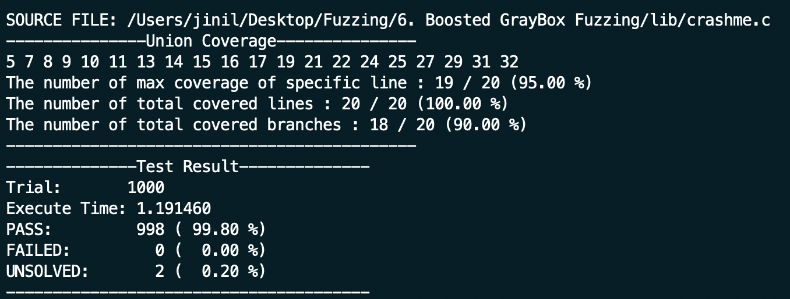

## The Fuzzing 
> Fuzzing is a dynamic testing method among software testing methods that test a program by giving random input values to the target program.

## Fuzzer Architecture 


## Workflow (Boosted GrayBox Fuzzing)
1. Configuration by user 
    - target program path 
    - trial, test oracle, mutation
2. Fuzzer run & Configuration Setting check 
3. Load seed data & Mutation (mutation opertaors)
    - delete_random_character 
    - insert_random_character
    - bit_flip_random_character
    - byte_flip_random_character
    - byte_simple_arithmatic
    - known_integer
4. Normalize seed choice proportion & Choose the seed probabilistically
    - seed choice proportion is decided by whether the seed increases branch coverage or not.
    - In the other words, the case is when the seed finds a new path. 
4. Execute target program & gcov
    - After executing the target program, give selected seed as input.  
5. Get the execution result as pipe and conduct a test oracle & Read the gcov file to get coverage information
    - As the coverage increases, add the seed that was given as input. 
6. Repitition 3~5 steps
7. Summary

### Test 

#### 1. Example Code
```c
#include "fuzzer.h"
#include <string.h>

int main(void){
    test_config_t config ; 
    config_init(&config) ;

    // char * source_file = "lib/cgi_decode.c"; 
    char * source_files[1] = {"../lib/crashme.c"}; 
    config.num_of_source_files = 1; 
    for(int i = 0 ; i < config.num_of_source_files; i++) {
        config.source_file[i] = source_files[i] ;
    }

    config.input_method = STDIN_INPUT ;

    strcpy(config.seed_dir,"../seed_dir/crashme_seed_dir"); 
    config.binary_path = "../lib/crashme"; 
    config.mutation_trial = 3; 

    config.trial = 1000; 
    fuzzer_main(&config);
}
```

#### 2. Execution 
```bash
$ cd 6. Boosted GrayBox Fuzzing/test 
$ make 
$ ./crashme_test_driver
```
#### 3. Result

You can check the code coverage which includes line coverage, branch coverage, etc. In addition, it shows if the test case is passed or not. The number of failed or unsolved the result equals to the number of bugs in the program.

Thus, we can know whether the program has the bugs or not through fuzzing framework and get the seed which occurs the bug in the directory named seed_dir, and stacked the result on the TestResult.csv file.




### Link 
> ### <a href="https://www.fuzzingbook.org/html/Tours.html">Tours through the Book</a>

### Step
1. Introduction to Software Testing
2. Fuzzing: Breaking Things with Random Inputs 
3. Code coverage 
4. Mutation-Based Fuzzing 
5. Graybox Fuzzing
6. Boosted Graybox Fuzzing
